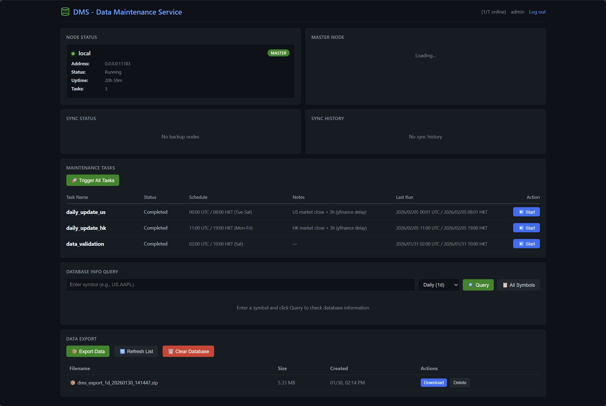
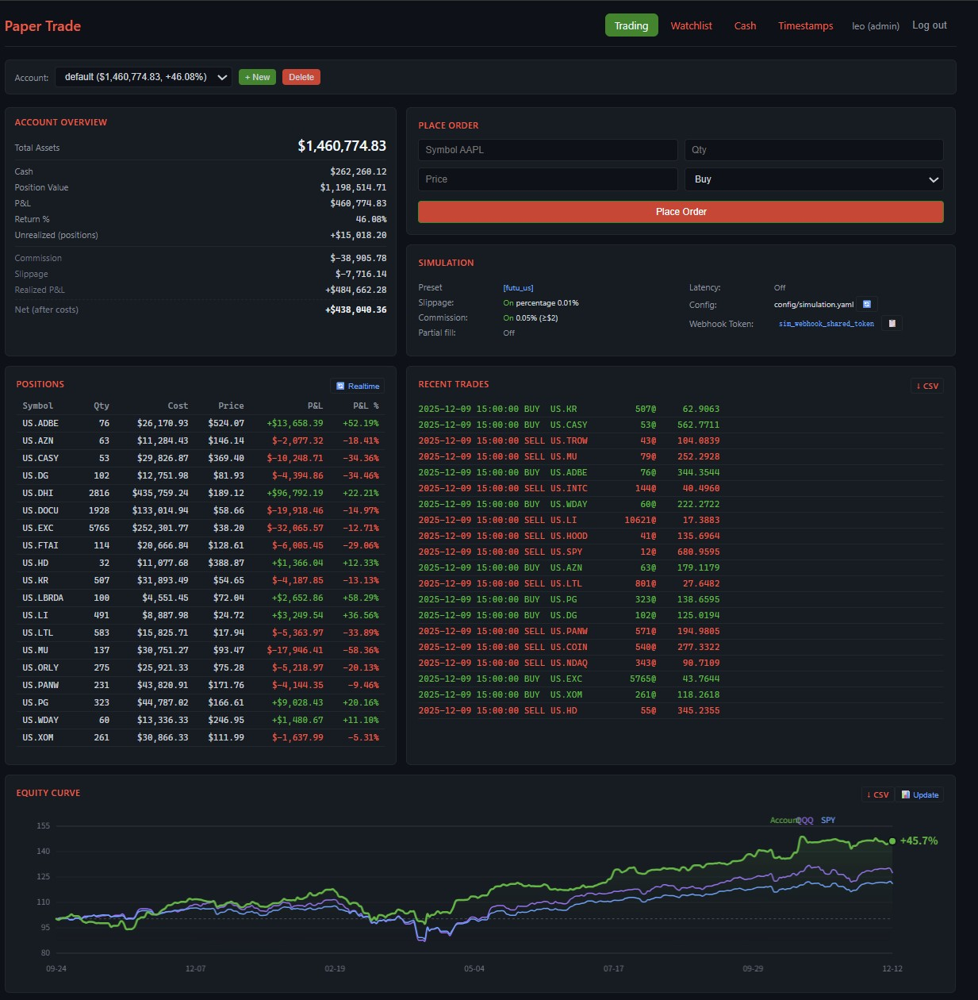
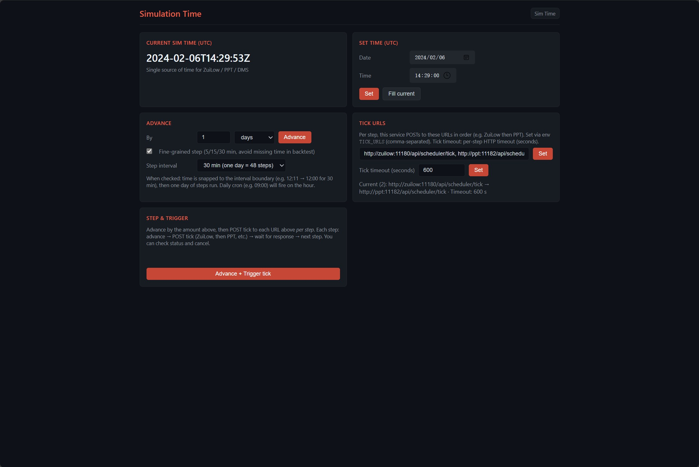
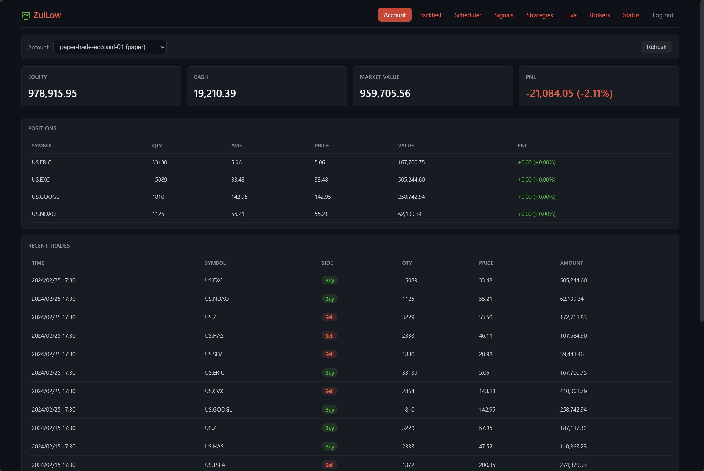
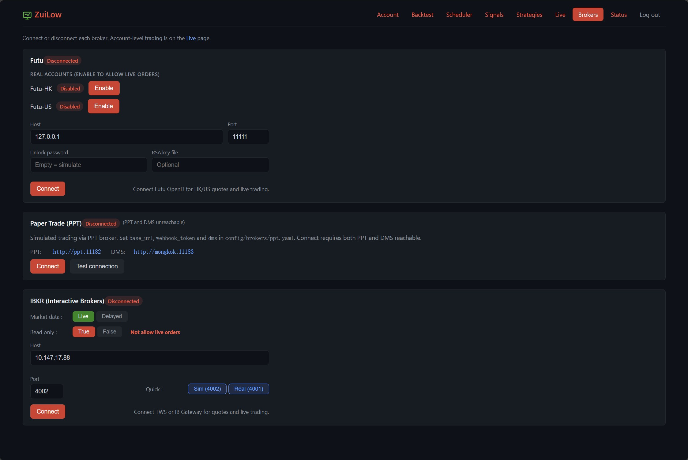
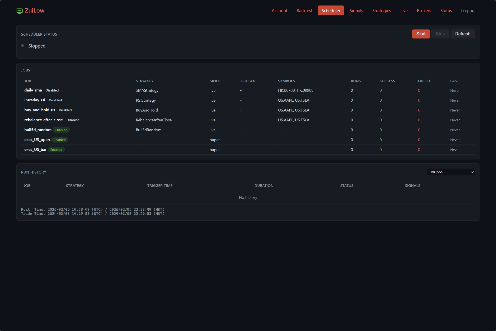
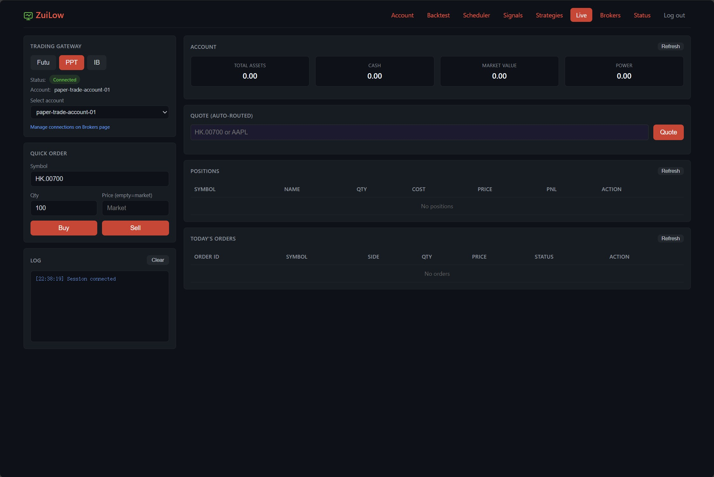
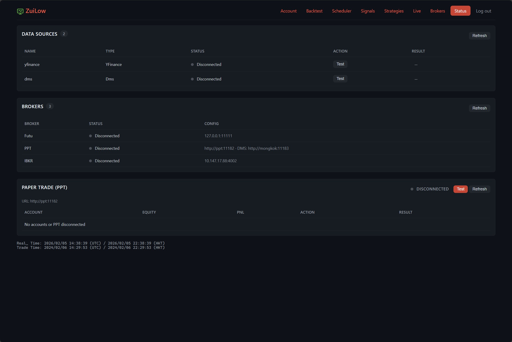

# One-line intro

  ZuiLow: the lowest-frequency, slowest, stable automated trading platform.

### Why

```
┌─────────────────────────────────────────────────────────────┐
│                 Trading latency pyramid                     │
├─────────────────────────────────────────────────────────────┤
│                                                             │
│                        ▲                                    │
│                       /\                                    │
│                      /  \     FPGA + Colocation             │
│                     / <1μs\    (pro HFT)                    │
│                    /______\                                 │
│                   /        \   Colocation + Direct Feed     │
│                  / 10-50μs  \  (quant funds)                │
│                 /____________\                              │
│                /              \  DMA / Sponsored Access     │
│               /  100μs - 1ms   \ (institutional)            │
│              /__________________\                           │
│             /                    \ Broker API               │
│            /     1ms - 50ms       \ (IB/Alpaca)             │
│           /________________________\                        │
│          /                          \ Retail brokers        │
│         /       50ms - 500ms         \ (Futu/Tiger)         │
│        /______________________________\                     │
│       /                                \                    │
│      / !!!We are here — no struggle !!! \   ← ZuiLow        │
│     /  (low-freq · slow · stable · auto) \                  │
│    /______________________________________\                 │
│                                                             │
│  Lower latency → higher cost → higher strategy bar          │
│                                                             │
└─────────────────────────────────────────────────────────────┘
```

### Components

Sai consists of five parts:

- **DMS** — historical data maintenance and sync
- **PPT** — paper trading and webhooks
- **stime** — simulated time service
- **ZuiLow** — strategy scheduling and multi-broker execution
- **simulate** — full-stack simulation (stime + ZuiLow + PPT + DMS)

### UI snapshots

- **DMS**  
  

- **PPT**  
  

- **stime / simulate**  
  

- **ZuiLow** (accounts, brokers, jobs, live, status)  
    
    
    
    
  

### Try it on Docker

**Prerequisites:** Docker and Docker Compose. DMS is optional (external); set `DMS_BASE_URL` in `docker/.env` if you use it.

**First run** (from repo root):

```bash
cd simlulate
./deploy_sim.sh up
```

This builds and starts **stime**, **ZuiLow**, and **PPT**. After startup you'll see:

| Service | URL (default) |
|---------|----------------|
| stime (set/advance time) | http://localhost:11185 |
| ZuiLow | http://localhost:11180 |
| PPT | http://localhost:11182 |


### Run each subproject independently

From the repo root, each component can be started on its own (install deps and set config per project; see each project's README).

| Project   | Command (in project dir)     | Default URL / port   |
|-----------|------------------------------|------------------------|
| **DMS**   | `cd dms && ./start_dms.sh`    | http://localhost:11183 |
| **stime** | `cd stime && python app.py`  | http://localhost:11185 |
| **PPT**   | `cd ppt && ./start_ppt.sh`    | http://localhost:11182 |
| **ZuiLow**| `cd zuilow && ./start_zuilow.sh` | http://localhost:11180 |

Alternatively run with `python app.py` inside each project (after `pip install -r requirements.txt` and env/config). DMS and PPT may need `DMS_BASE_URL` / DB config; ZuiLow may need datasource and broker config. The **simulate** stack (see above) runs stime + ZuiLow + PPT together via Docker.