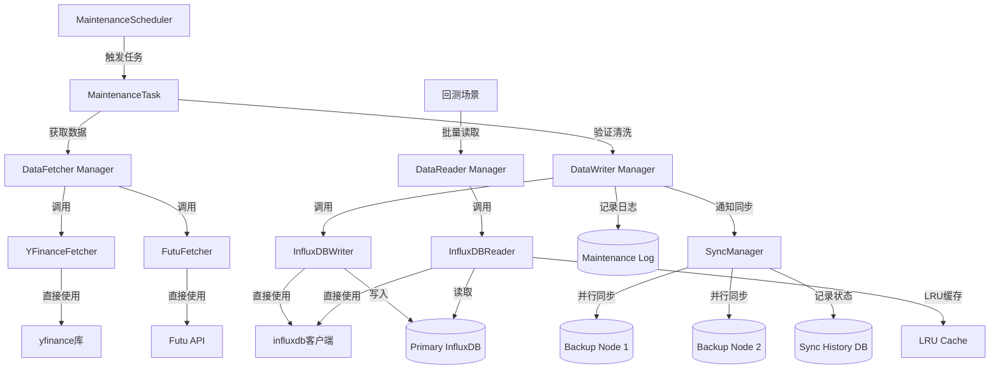

# DMS 架构设计

> DMS 是一个**完全独立**的数据维护服务，专门用于历史数据的获取、维护、同步和备份。
> 
> **核心原则**：DMS 可以单独部署和运行。

## 一、架构概览

**DMS 核心价值：自动、智能、可靠的数据维护**

DMS 负责：
- 从外部数据源（YFinance、Futu等）获取历史数据
- 自动检测和补齐缺失数据（网络中断后自动恢复）
- 维护本地/远程数据库（InfluxDB等）
- 同步数据到多个备份节点
- 数据质量校验和修复

### 系统架构图

```
                    ┌───────────────┐
                    │  InfluxDB     │
                    │  (共享数据库)  │
                    └───────────────┘
                            ▲
                            │ 写入/维护数据
                            │
┌─────────────────────────────────────────────────────────┐
│            Data Maintenance Service (DMS)               │
│                  (完全独立项目)                           │
│                                                          │
│  ┌──────────────────────────────────────────────────┐  │
│  │  Maintenance Scheduler (维护调度器)               │  │
│  │  - 定时任务 (Cron/Interval)                      │  │
│  │  - 事件触发 (数据更新事件)                        │  │
│  └──────────────────────────────────────────────────┘  │
│                            │                              │
│  ┌──────────────────────────────────────────────────┐  │
│  │  Data Fetcher (数据获取器)                        │  │
│  │  - YFinanceFetcher (直接使用 yfinance)           │  │
│  │  - FutuFetcher (直接使用 Futu API)               │  │
│  │  - 增量检测 (检查最新日期)                        │  │
│  │  - 数据验证和清洗                                  │  │
│  └──────────────────────────────────────────────────┘  │
│                            │                              │
│  ┌──────────────────────────────────────────────────┐  │
│  │  Data Writer (数据写入器)                         │  │
│  │  - InfluxDBWriter (直接使用 influxdb 客户端)      │  │
│  │  - 增量保存 (去重、合并)                           │  │
│  │  - 元数据更新                                      │  │
│  └──────────────────────────────────────────────────┘  │
│                            │                              │
│  ┌──────────────────────────────────────────────────┐  │
│  │  Data Reader (数据读取器)                          │  │
│  │  - InfluxDBReader (直接使用 influxdb 客户端)       │  │
│  │  - 批量读取 (支持回测场景)                          │  │
│  │  - LRU 缓存 (减少重复查询)                         │  │
│  │  - 索引优化 (快速定位数据)                          │  │
│  └──────────────────────────────────────────────────┘  │
│                            │                              │
│  ┌──────────────────────────────────────────────────┐  │
│  │  Sync Manager (同步管理器)                        │  │
│  │  - 多目标同步 (备份节点)                           │  │
│  │  - 增量同步 (只同步新数据)                         │  │
│  │  - 并行同步 (ThreadPoolExecutor)                  │  │
│  │  - 同步状态跟踪                                    │  │
│  └──────────────────────────────────────────────────┘  │
└─────────────────────────────────────────────────────────┘
                            │
                            │ 写入/同步
                            ▼
┌─────────────────────────────────────────────────────────┐
│                    数据存储层                             │
│  ┌──────────────┐  ┌──────────────┐  ┌──────────────┐  │
│  │ InfluxDB     │  │ InfluxDB     │  │ InfluxDB     │  │
│  │ (主节点)     │  │ (从节点1)    │  │ (从节点2)    │  │
│  │              │  │ (完全备份)   │  │ (完全备份)   │  │
│  └──────────────┘  └──────────────┘  └──────────────┘  │
└─────────────────────────────────────────────────────────┘
                            ▲
                            │ 主从同步
                            │
┌─────────────────────────────────────────────────────────┐
│              主从通信 (HTTP API)                          │
│  ┌──────────────────────────────────────────────────┐  │
│  │  主节点 → 从节点：主动推送数据更新                  │  │
│  │  从节点 → 主节点：请求同步数据                      │  │
│  └──────────────────────────────────────────────────┘  │
└─────────────────────────────────────────────────────────┘
```

## 二、核心功能

### 2.1 维护任务

| 任务类型 | 说明 |
|---------|------|
| **增量更新** | 检查最新日期，只获取缺失数据 |
| **全量同步** | 重新获取所有历史数据（初始化/修复） |
| **数据校验** | 检查完整性、价格合理性、异常检测 |
| **数据修复** | 自动修复问题，对比多源选择最优 |

### 2.2 触发方式

- **定时触发** (Cron/Interval)：盘后更新、盘中更新、周末维护
- **手动触发**：通过 API 或 Web UI 手动执行

### 2.3 数据流

```
获取数据 → 验证清洗 → 写入主库 → 同步备份 → 记录日志
```

DMS 使用**增量同步**：只同步上次同步后的新数据，首次同步时同步配置的历史数据（默认5年）。

详细配置参考：[同步策略文档](sync_strategy.md)

## 三、独立项目设计

### 3.1 完全独立
- **独立的数据源实现**：DMS 自己实现简化的数据源接口
- **独立的服务**：可以单独部署和运行（独立 HTTP 服务端口 11183）

### 3.2 数据源实现

#### Fetcher Sources（数据获取源）

- **YFinanceFetcher**
  - 直接使用 `yfinance` 库
  - 实现 `fetch_history(symbol, start, end, interval)` 方法
  - 支持限流和重试

- **FutuFetcher**（可选）
  - 直接使用 Futu API
  - 实现历史数据获取

#### Writer Targets（数据写入目标）

- **InfluxDBWriter**
  - 直接使用 `influxdb` 客户端库
  - 实现 `write_data(symbol, data, interval)` 方法
  - 实现 `get_latest_date(symbol, interval)` 方法（用于增量检测）
  - 支持多服务器写入

#### Reader（数据读取器，支持回测场景）

- **InfluxDBReader**
  - 直接使用 `influxdb` 客户端库
  - 实现 `read_history(symbol, start, end, interval)` 方法
  - **批量读取优化**：支持一次读取多个 symbol 的数据
  - **缓存机制**：LRU 缓存，减少重复查询
  - **索引优化**：利用 InfluxDB 的时间索引，快速定位数据
  - **分页读取**：大数据量时支持分页，避免内存溢出

### 3.4 独立服务设计

DMS 可以作为独立服务运行：

- **独立 HTTP 服务**：默认端口 `11183`
- **独立进程**：可以单独启动和停止
- **独立日志**：`dms/logs/` 目录
- **独立配置**：`dms/config/dms.yaml`

## 五、数据流图



## 六、关键技术

| 技术点 | 说明 |
|--------|------|
| **增量检测** | 通过 `get_latest_date()` 检测最新日期，只获取缺失数据 |
| **批量读取** | 并行读取多个 symbol，支持回测场景 |
| **LRU 缓存** | 缓存历史查询结果，减少重复数据库访问 |
| **并行同步** | ThreadPoolExecutor 并行同步到多个备份节点 |
| **增量同步** | 只同步新数据，提高同步效率 |

## 七、核心优势

| 优势 | 说明 |
|------|------|
| **完全独立** | 可单独部署，独立配置和数据库 |
| **灵活配置** | 可配置历史数据范围（默认5年，可调整） |
| **回测优化** | 批量读取、LRU 缓存、并行查询 |
| **主从架构** | 主从模式，从节点完全备份 |
| **高效同步** | 增量同步 + 并行处理 |
| **可靠性** | 状态跟踪、失败重试、断点续传 |
| **可观测性** | 维护日志、API 服务、实时监控 |

## 相关文档

- **[数据质量](data_quality.md) - 自动恢复机制、数据质量保证** ⭐
- [同步策略](sync_strategy.md) - 详细的同步方案设计
- [主从模式](master_slave.md) - 主从架构详细设计
- [API 参考](api_reference.md) - API 接口文档
